Instalar Loganalyzer con MySQL
==============================

Debemos intalar primero; Apache, PHP y MariaDB
++++++++++++++++++++++++++++++++++++++++++++++++

Instalamos Apache
+++++++++++++++++++
.::

	# yum --disablerepo=\* --enablerepo=c6-media install -y  httpd

	# service httpd start

	# chkconfig --list httpd
	httpd          	0:desactivado	1:desactivado	2:desactivado	3:desactivado	4:desactivado	5:desactivado	6:desactivado

	# chkconfig httpd on

	# vi /etc/sysconfig/iptables

	-A INPUT -m state --state NEW -m tcp -p tcp --dport 80 -j ACCEPT
	-A INPUT -m state --state NEW -m tcp -p tcp --dport 443 -j ACCEPT

	# service iptables restart

Instalamos PHP
+++++++++++++++
.::

	# yum install -y php php-mysql php-gd php-devel php-cli

	# vi /var/www/html/test.php

	<?php

	// Muestra toda la información, por defecto INFO_ALL
	phpinfo();

	// Muestra solamente la información de los módulos.
	// phpinfo(8) hace exactamente lo mismo.
	phpinfo(INFO_MODULES);
	?>

	# service httpd restart

	Probar la pagina direccion-ip/test.php

Removemos MySQL
+++++++++++++++
.::

	# rpm -qa | grep mysql
	mysql-libs-5.1.71-1.el6.x86_64

	# yum remove mysql* mysql-server mysql-devel mysql-libs

Instalamos MariaDB, buscamos el mejor repo en el sitio oficial de MariaDB
++++++++++++++++++++++++++++++++++++++++++++++++++++++++++++++++++++++++++
.::

	# vi /etc/yum.repos.d/MariaDB.repo

		# MariaDB 10.1 CentOS repository list - created 2016-12-17 01:46 UTC
		# http://downloads.mariadb.org/mariadb/repositories/
		[mariadb]
		name = MariaDB
		baseurl = http://yum.mariadb.org/10.1/centos6-amd64
		gpgkey=https://yum.mariadb.org/RPM-GPG-KEY-MariaDB
		gpgcheck=1

	# yum install MariaDB-server MariaDB-client

	# service mysql status

	# chkconfig --list mysql
	mysql          	0:desactivado	1:desactivado	2:activo	3:activo	4:activo	5:activo	6:desactivado

	# service mysql start

Configuramos MariaDB.::

	# mysql_secure_installation

	NOTE: RUNNING ALL PARTS OF THIS SCRIPT IS RECOMMENDED FOR ALL MariaDB
		  SERVERS IN PRODUCTION USE!  PLEASE READ EACH STEP CAREFULLY!

	In order to log into MariaDB to secure it, we'll need the current
	password for the root user.  If you've just installed MariaDB, and
	you haven't set the root password yet, the password will be blank,
	so you should just press enter here.

	Enter current password for root (enter for none): 
	OK, successfully used password, moving on...

	Setting the root password ensures that nobody can log into the MariaDB
	root user without the proper authorisation.

	New password: 
	Re-enter new password: 
	Password updated successfully!
	Reloading privilege tables..
	 ... Success!

	By default, a MariaDB installation has an anonymous user, allowing anyone
	to log into MariaDB without having to have a user account created for
	them.  This is intended only for testing, and to make the installation
	go a bit smoother.  You should remove them before moving into a
	production environment.

	Remove anonymous users? [Y/n] y
	 ... Success!

	Normally, root should only be allowed to connect from 'localhost'.  This
	ensures that someone cannot guess at the root password from the network.

	Disallow root login remotely? [Y/n] y
	 ... Success!

	By default, MariaDB comes with a database named 'test' that anyone can
	access.  This is also intended only for testing, and should be removed
	before moving into a production environment.

	Remove test database and access to it? [Y/n] y
	 - Dropping test database...
	 ... Success!
	 - Removing privileges on test database...
	 ... Success!

	Reloading the privilege tables will ensure that all changes made so far
	will take effect immediately.

	Reload privilege tables now? [Y/n] y
	 ... Success!

	Cleaning up...

	All done!  If you've completed all of the above steps, your MariaDB
	installation should now be secure.

	Thanks for using MariaDB!

.::

	# mysql  -u root -p
	Enter password: 
	Welcome to the MariaDB monitor.  Commands end with ; or \g.
	Your MariaDB connection id is 11
	Server version: 10.1.20-MariaDB MariaDB Server

	Copyright (c) 2000, 2016, Oracle, MariaDB Corporation Ab and others.

	Type 'help;' or '\h' for help. Type '\c' to clear the current input statement.

	+--------------------+
	| Database           |
	+--------------------+
	| information_schema |
	| mysql              |
	| performance_schema |
	+--------------------+
	3 rows in set (0.00 sec)

	MariaDB [(none)]> 

	# netstat -nat
	Active Internet connections (servers and established)
	Proto Recv-Q Send-Q Local Address               Foreign Address             State      
	tcp        0      0 0.0.0.0:22                  0.0.0.0:*                   LISTEN      
	tcp        0      0 192.168.1.22:22             192.168.1.4:47012           ESTABLISHED 
	tcp        0      0 :::80                       :::*                        LISTEN      
	tcp        0      0 :::22                       :::*                        LISTEN      
	tcp        0      0 :::3306                     :::*                        LISTEN 

	# vi /etc/sysconfig/iptables
	-A INPUT -m state --state NEW -m tcp -p tcp --dport 3306 -j ACCEPT

	# service iptables restart

Ahora vemos si tenemos el rsyslog y sino lo instalamos
+++++++++++++++++++++++++++++++++++++++++++++++++++++++++
.::

	# rpm -qa | grep rsyslog
	rsyslog-5.8.10-8.el6.x86_64

	# yum install rsyslog*

	# service rsyslog status
	# chkconfig rsyslog on

Importamos la base de datos y tablas a MariaDB, de esta forma la creamos
++++++++++++++++++++++++++++++++++++++++++++++++++++++++++++++++++++++++
.::

	# yum install rsyslog-mysql

	# vi /usr/share/doc/rsyslog-mysql-5.8.10/createDB.sql

	CREATE DATABASE rsyslogdb;
	USE rsyslogdb;
	CREATE TABLE SystemEvents
	(
	[...]

	# mysql -u root -p < /usr/share/doc/rsyslog-mysql-5.8.10/createDB.sql

Verificamos
+++++++++++

	# mysql -u root -p
	Enter password: 
	Welcome to the MariaDB monitor.  Commands end with ; or \g.
	Your MariaDB connection id is 13
	Server version: 10.1.20-MariaDB MariaDB Server

	Copyright (c) 2000, 2016, Oracle, MariaDB Corporation Ab and others.

	Type 'help;' or '\h' for help. Type '\c' to clear the current input statement.

	MariaDB [(none)]> show databases;
	+--------------------+
	| Database           |
	+--------------------+
	| information_schema |
	| mysql              |
	| performance_schema |
	| rsyslogdb          |
	+--------------------+
	4 rows in set (0.00 sec)

	MariaDB [(none)]> use rsyslogdb
	Reading table information for completion of table and column names
	You can turn off this feature to get a quicker startup with -A

	Database changed
	MariaDB [rsyslogdb]> show tables;
	+------------------------+
	| Tables_in_rsyslogdb    |
	+------------------------+
	| SystemEvents           |
	| SystemEventsProperties |
	+------------------------+
	2 rows in set (0.00 sec)

	MariaDB [rsyslogdb]> select count(*) from SystemEvents;
	+----------+
	| count(*) |
	+----------+
	|        0 |
	+----------+
	1 row in set (0.00 sec)

	MariaDB [rsyslogdb]> 

	MariaDB [rsyslogdb]> GRANT ALL ON rsyslogdb.* TO rsysloguser@localhost IDENTIFIED BY 'Venezuela21';
	Query OK, 0 rows affected (0.00 sec)

	MariaDB [rsyslogdb]> flush privileges;
	Query OK, 0 rows affected (0.00 sec)

	MariaDB [rsyslogdb]> exit
	Bye

Ahora editamos el archivo de configuracion del rsyslog.conf
+++++++++++++++++++++++++++++++++++++++++++++++++++++++++++
.::

	# vi /etc/rsyslog.conf

	# Provides UDP syslog reception
	$ModLoad imudp
	$UDPServerRun 514

	# Provides TCP syslog reception
	$ModLoad imtcp
	$InputTCPServerRun 514

	## Agregamos estas lineas ##
	$ModLoad ommysql
	*.* :ommysql:127.0.0.1,rsyslogdb,rsysloguser,Venezuela21
	$AllowedSender UDP, 127.0.0.1, 192.168.1.0/24
	$AllowedSender TCP, 127.0.0.1, 192.168.1.0/24

.::

	# tail -f /var/log/messages &

	# chkconfig --list rsyslog
	rsyslog        	0:desactivado	1:desactivado	2:activo	3:activo	4:activo	5:activo	6:desactivado

	# service rsyslog restart

	# netstat -nat
	Active Internet connections (servers and established)
	Proto Recv-Q Send-Q Local Address               Foreign Address             State      
	tcp        0      0 0.0.0.0:22                  0.0.0.0:*                   LISTEN      
	tcp        0      0 0.0.0.0:514                 0.0.0.0:*                   LISTEN      
	tcp        0      0 127.0.0.1:51578             127.0.0.1:3306              ESTABLISHED 
	tcp        0      0 192.168.1.22:22             192.168.1.4:47012           ESTABLISHED 
	tcp        0      0 :::80                       :::*                        LISTEN      
	tcp        0      0 :::22                       :::*                        LISTEN      
	tcp        0      0 :::514                      :::*                        LISTEN      
	tcp        0      0 :::3306                     :::*                        LISTEN      
	tcp        0      0 ::ffff:127.0.0.1:3306       ::ffff:127.0.0.1:51578      ESTABLISHED

	# vi /etc/sysconfig/iptables

	-A INPUT -m state --state NEW -m tcp -p tcp --dport 514 -j ACCEPT

	service iptables restart

Ahora podemos ir viendo si todo marcha bien, con solo consultar la tabla ya podremos ver si rsyslog esta mandando la informacion a la DB
++++++++++++++++++++++++++++++++++++++++++++++++++++++++++++++++++++++++++++++++++++++++++++++++++++++++++++++++++++++++++++++++++++++++
.::

	MariaDB [rsyslogdb]> select count(*) from SystemEvents
		-> ;
	+----------+
	| count(*) |
	+----------+
	|        7 |
	+----------+
	1 row in set (0.00 sec)

	MariaDB [rsyslogdb]> 

	Podemos ayudarnos con "nc" y "logger" para ir verficando

	# echo '<14>161.196.24.200 tag Message' | nc 192.168.1.22 514

	# logger -t WARN esto es una prueba

	MariaDB [rsyslogdb]> select count(*) from SystemEvents;
	+----------+
	| count(*) |
	+----------+
	|        9 |
	+----------+
	1 row in set (0.00 sec)

Ahora vamos a instalar Loganalyzer.
++++++++++++++++++++++++++++++++++++++++

Descargamos la ultima version http://loganalyzer.adiscon.com/downloads/
.::

	# tar xvzf loganalyzer-4.1.5.tar.gz

	# cp -r loganalyzer-4.1.5/src/ /var/www/html/loganalyzer
	# cp -r loganalyzer-4.1.5/contrib/* /var/www/html/loganalyzer/

	# cd /var/www/html/loganalyzer/

	# chmod +x configure.sh secure.sh

	# ./configure.sh

Como buena practica nos creamos un virtualhost
++++++++++++++++++++++++++++++++++++++++++++++++++

	# vi /etc/httpd/conf.d/loganalyzer.conf

	<VirtualHost *:80>
		     ServerAdmin webmaster@example.com
		     DocumentRoot /var/www/html/loganalyzer
		     ServerName www.public.com
		     ServerAlias public.com
		     ErrorLog /var/log/httpd/error-loganalyzer.log
		     # CustomLog /var/log/httpd/requests-loganalyzer.log
	</VirtualHost>
   
	# service httpd start

	# tail -f /var/log/httpd/error-loganalyzer.log &

Procedemos a terminar la configuracion, nos vamos al navegador http://direccion-ip o http://nombre-domino
++++++++++++++++++++++++++++++++++++++++++++++++++++++++++++++++++++++++++++++++++++++++++++++++++++++++++

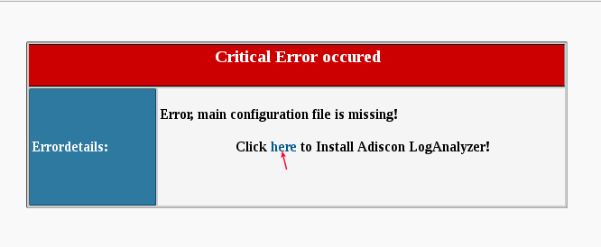

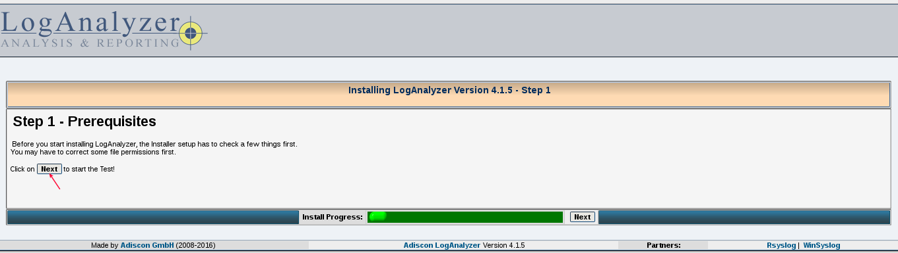

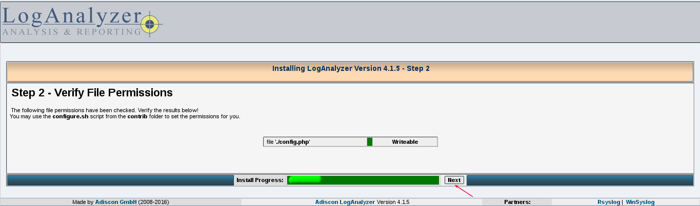

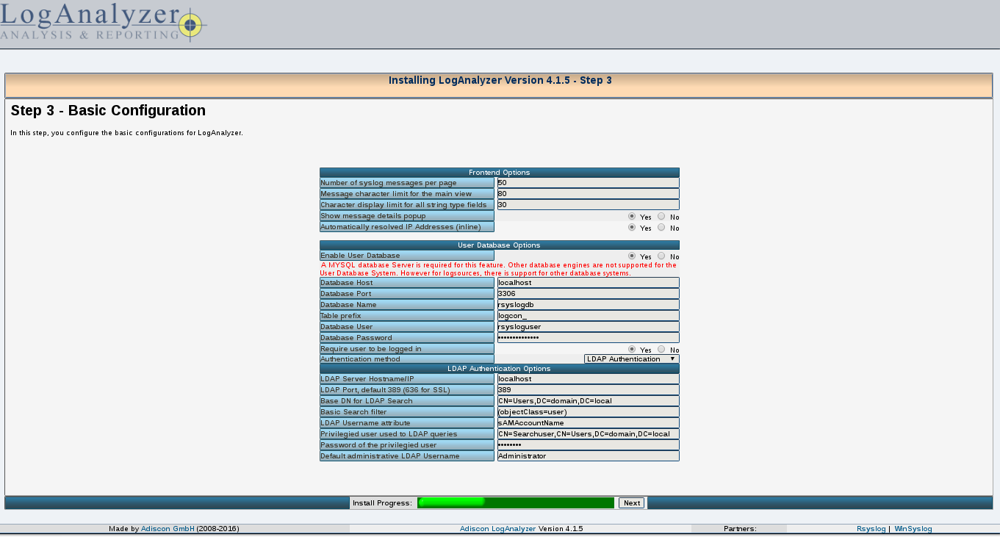

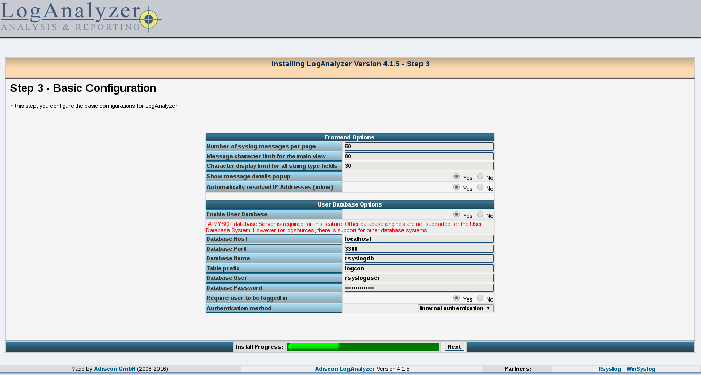

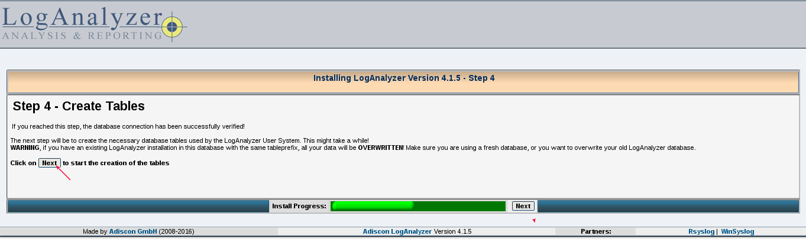

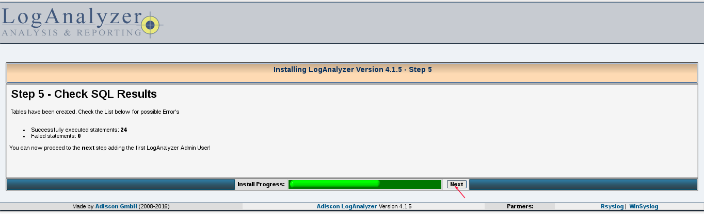

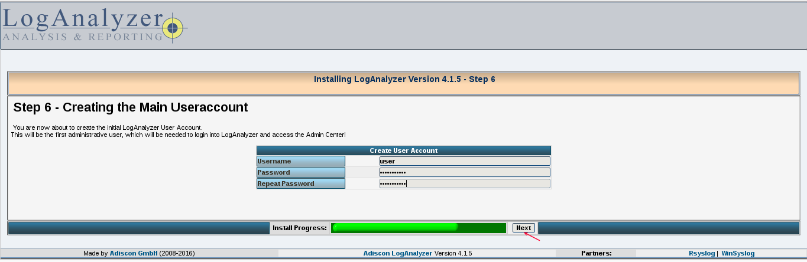

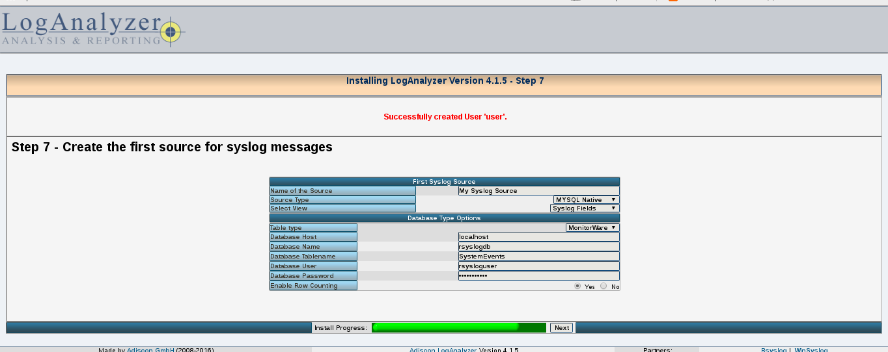

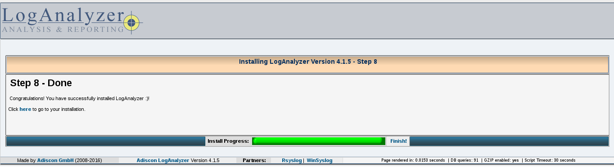

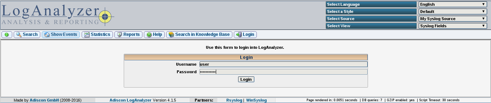

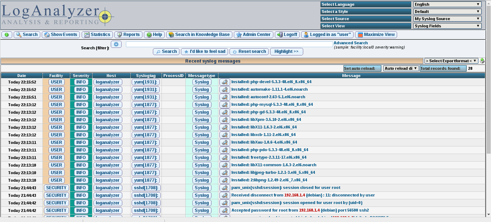

Ahora desde un servido remoto realizamos una prueba.
++++++++++++++++++++++++++++++++++++++++++++++++++++
.::

	$ nc 192.168.1.22 514
	(UNKNOWN) [192.168.1.22] 514 (shell) : No route to host
	cgome1@debian:~$ nc 192.168.1.22 514
	Prueba de envio
	.
	^C

Verificamos en la pagina
+++++++++++++++++++++++++

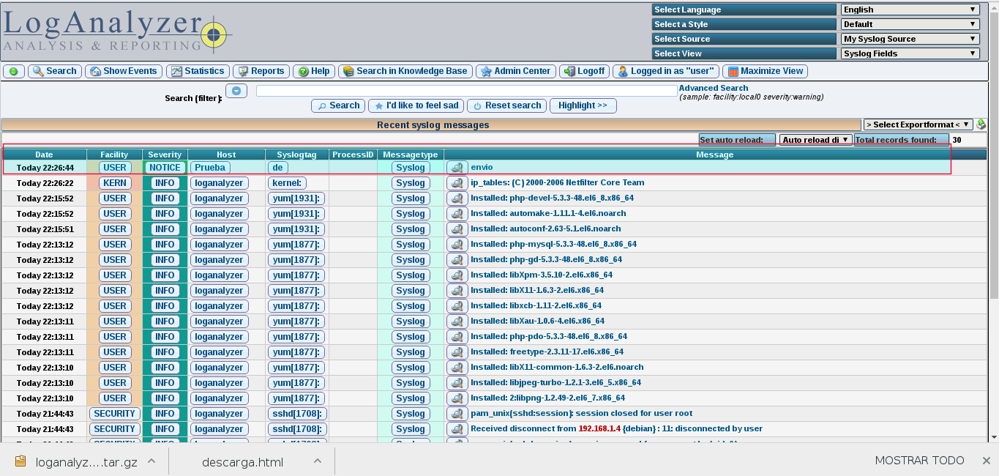

Ahora configuramos el rsyslog de los servidores que seran clientes para que envien sus logs
++++++++++++++++++++++++++++++++++++++++++++++++++++++++++++++++++++++++++++++++++++++++++++
.::

	# vi /etc/rsyslog.conf 

	*.* @@192.168.1.22:514

	# /etc/init.d/rsyslog restart

	# logger -t INFO esto si es un server

	Vemos en el loganalyzer

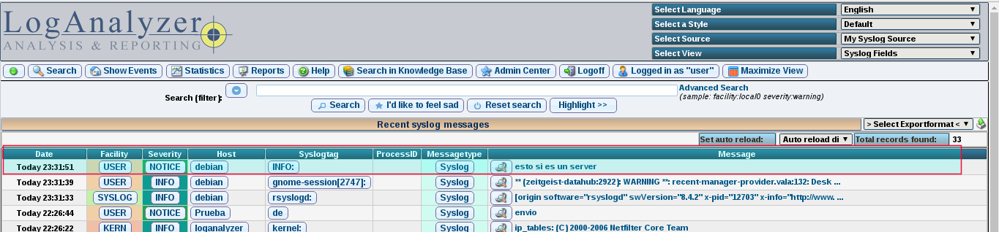

